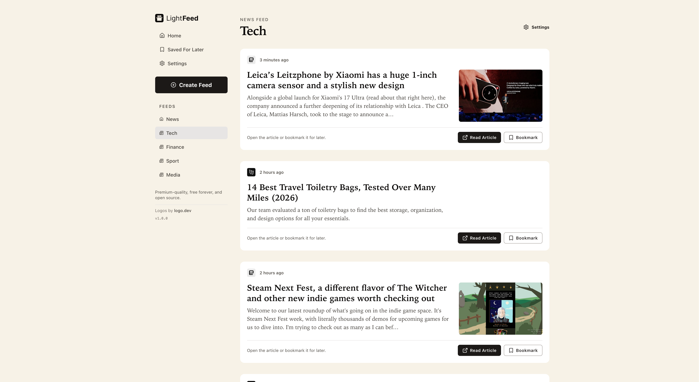

# LightFeed

LightFeed is a open source, self-hosted RSS reader focused on speed, low operational overhead, and user-controlled feed composition.

It lets you combine multiple RSS sources into custom feeds and keeps storage lightweight by saving configuration + bookmarks locally in SQLite.



## Why this project exists

- Fast, readable RSS experience without algorithmic timelines
- Full control over feed sources
- Local-first persistence with minimal moving parts
- No tracking or telemetry

## Features

- Create multiple named feeds (example: `World News`, `Business`, `Sports`)
- Blend RSS sources into one recency-sorted stream per feed
- Mark one feed as your homepage/default stream
- Save and remove bookmarked articles
- Show per-feed fetch failures without hiding successful sources
- Keep article fetching live (articles are not fully persisted)

## Tech stack

- Next.js App Router (`src/app`)
- React
- SQLite via built-in `node:sqlite`
- Tailwind CSS v4

## Install (Beginner Friendly)

### 1. Install Node.js (required)

Use **Node.js 22 or newer**. This project uses `node:sqlite`, which is only available in newer Node versions.

Check your version:

```bash
node -v
```

If you need Node, install from [nodejs.org](https://nodejs.org/) (LTS recommended).

### 2. Clone the project

```bash
git clone <your-repo-url>
cd rss-news
```

### 3. Install dependencies

```bash
npm install
```

### 4. Logo.dev Token (Optional) Add `.env.local` or set it in your production environment

LightFeed uses [logo.dev](https://logo.dev/) to fetch publisher logos for news sources in article cards.

Add this token if you want more reliable logo rendering:

```bash
NEXT_PUBLIC_LOGO_DEV_TOKEN=your_token_here
```

The app still works if you skip this.

For most personal/open-source usage, logo.dev's free plan is usually more than enough.

### 5. Start the app

```bash
npm run dev
```

Open: `http://localhost:3000`

### 6. What happens on first run

- The app creates `db/lightfeed.sqlite` automatically.
- Schema and lightweight seed data are initialized automatically.
- You can immediately browse/edit feeds from the UI.

## Common commands

```bash
npm run dev              # start local development server
npm run build            # production build (webpack)
npm run build:turbopack  # production build (turbopack)
npm run start            # run production build
npm run lint             # run eslint
```

## Deployment guides

LightFeed currently stores feed configuration and bookmarks in local SQLite (`db/lightfeed.sqlite`).

- Works out of the box on hosts with persistent disk (VMs/containers with volumes).
- Does not work as-is on stateless serverless platforms unless you migrate from SQLite to Postgres.

### 1. Deploy with Docker (recommended for current codebase)

Use Docker when you want the app exactly as it is today, with persistent SQLite data.

1. Create a `Dockerfile` in the project root:

```dockerfile
FROM node:22-alpine
WORKDIR /app

COPY package*.json ./
RUN npm ci

COPY . .
RUN npm run build

EXPOSE 3000
CMD ["npm", "run", "start"]
```

2. Build the image:

```bash
docker build -t lightfeed:latest .
```

3. Run with a persistent volume mounted to `/app/db`:

```bash
docker run -d \
  --name lightfeed \
  -p 3000:3000 \
  -v lightfeed_db:/app/db \
  -e NEXT_PUBLIC_LOGO_DEV_TOKEN=your_token_here \
  lightfeed:latest
```

4. Open `http://localhost:3000`.

Data survives container restarts because SQLite is stored in the `lightfeed_db` volume.

### 2. Other hosts (Railway, Fly.io, Render, VPS)

Any host that can run a Next.js Node server works:

```bash
npm install
npm run build
npm run start
```

If you keep SQLite, make sure `db/` is on persistent storage.

## Product model

User-facing term: **Feed**  
Storage term: **Page** (legacy internal naming in SQLite/lib functions)

A feed/page contains:

- `name`
- `is_homepage`
- many RSS sources (through `page_feeds`)

## App routes

- `/` - homepage/default feed stream
- `/feeds` - feed directory
- `/feeds/new` - create a feed
- `/feeds/[id]` - read a feed stream
- `/feeds/[id]/edit` - edit feed sources and settings
- `/saved` - bookmarked articles
- `/settings` - app settings (placeholder)

## API routes

- `GET /api/feeds` - list feeds
- `POST /api/feeds` - create feed
- `GET /api/feeds/[feedId]` - feed details + blended stream
- `PATCH /api/feeds/[feedId]` - update feed
- `DELETE /api/feeds/[feedId]` - delete feed
- `POST /api/preview-feed` - preview feed blend before saving
- `GET /api/saved-articles` - list saved articles
- `POST /api/saved-articles` - save article
- `DELETE /api/saved-articles` - remove saved article

## Data storage

SQLite file: `db/lightfeed.sqlite`

Primary tables:

- `pages(id, name, is_homepage, created_at)`
- `feeds(id, url, title, created_at)`
- `page_feeds(page_id, feed_id)`
- `saved_articles(...)`

The app stores configuration and saved metadata. RSS article content is fetched live.

## Project structure

- `src/app/*` - routes + server components
- `src/components/*` - reusable UI/client components
- `src/lib/lightfeed-pages.js` - feed/page operations
- `src/lib/lightfeed-db.js` - SQLite schema, migration, seed flow
- `src/lib/rss-parse.js` - RSS/Atom parsing
- `src/lib/rss-blend.js` - recency-first blend logic
- `src/lib/rss-stream.js` - fetch + orchestration
- `src/lib/feed-request.js` - request feed validation
- `src/lib/saved-articles-db.js` - bookmark persistence

## Lightweight-by-default principles

- Keep routes predictable
- Keep API semantics aligned with UI language (`feeds`)
- Avoid duplicated request validation logic
- Avoid storing full article payloads when not needed

## Troubleshooting

- `Cannot find module 'node:sqlite'` or similar:
  - upgrade Node.js to `22+`
- App starts but no articles appear:
  - verify feed URLs are valid RSS/Atom endpoints
  - check per-feed warnings shown in the UI
- Database reset for local development:
  - stop server
  - delete `db/lightfeed.sqlite`
  - restart with `npm run dev`

## Security note

Feed URLs are user-provided and fetched server-side. If you deploy this publicly, add network controls/rules to prevent abuse (for example SSRF protections and outbound restrictions).

## Contributing

Contributions are welcome.

Suggested workflow:

1. Fork/branch from `main`
2. Keep each update small and self-contained (one focused change per PR)
3. Do not include scattered, unrelated edits across multiple random parts of the app
4. Run `npm run lint` and make sure all lint checks pass
5. Ensure accessibility checks pass at least AA with a minimum 3.5:1 visibility/contrast baseline for UI copy and text content
6. Open a pull request with a clear description of what changed and why

Accessibility reference:

- W3C Web Accessibility Initiative (WAI): https://www.w3.org/WAI/
- WCAG standards and guidance: https://www.w3.org/WAI/standards-guidelines/wcag/

Maintainer policy:

- The project owner may decline, ignore, or remove updates to keep the app clean and aligned with its mission.
- Changes that move the app away from its mission will not be accepted.
- If you want to take the app in a different direction, feel free to fork this repository and use it as a starting point/boilerplate.

## License

MIT. See [LICENSE](./LICENSE).
